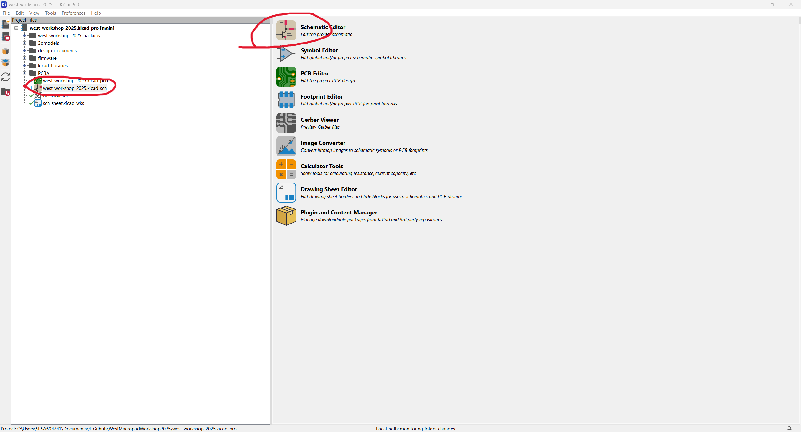
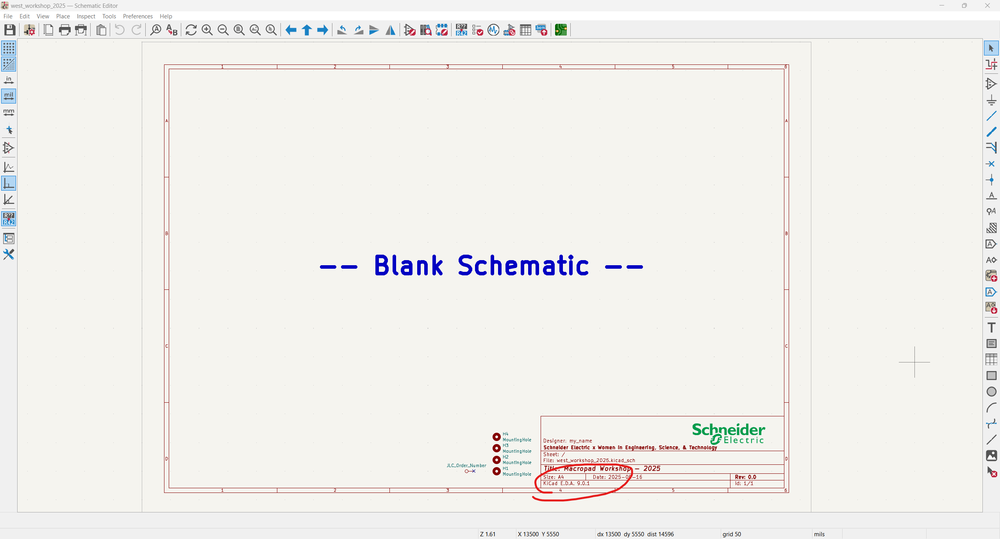
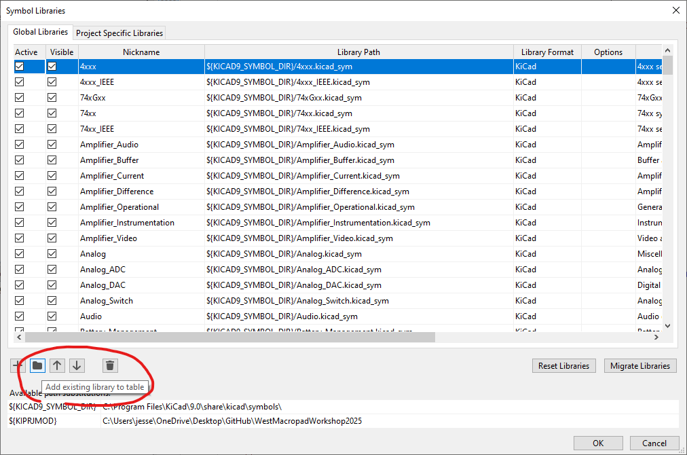
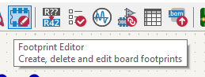

# WestMacropadWorkshop2025
This repository is intended to guide the user through the design of a small Macropad using KiCAD for schematic capture and PCB layout, fusion 360 for enclosure design, and QMK as the foundation for firmware.

> Students should be guided through the material by an instructor, there's not enough info for this repository to stand on its own (yet)

Step By Step - Creating Macropad Schematic
-
1) Clone this repository, or just copy WestMacropadWorkshop2025 to your local machine
2) Open **WestMacropadWorkshop2025/west_workshop_2025.kicad_pro**
    - This should automatically launch kicad 9
    - If not launch kicad 9 manually, and then go *File->Open Existing Project* and navigate to the above file
3) Double click **west_workshop_2025.kicad_sch** or launch the **Schematic Editor**

4) Your screen hopfully looks like this. You should be on Kicad v9 or higher.

5) Import WEST libaries
    - I've created several footprints and symbols for the core components of the basic macropad
    - To use these symbols we need to **tell KiCad where the *libraries* are stored**
    - Go to **preferences->manage symbol libraries**
    - Select the **add existing libary to table**, and point the tool to ***<your_path>\WestMacropadWorkshop2025\kicad_libraries\0_west_symbols.kicad_sym***
    - Once complete you should see "0_west_symbol" listed in the table view, hit **ok** to close the view and apply your changes
    
    - We'll have to **do the same for the footprint libarary**, launch the **footprint editor**
    - 
    - Go to **preferences->manage footprint libraries**, and point the tool to ***<your_path>\WestMacropadWorkshop2025/kicad_libraries/0_west_footprints.pretty***

6) Setup Symbol Libraries
    - Navigate to the **right toolbar** and click the ***"place symbols"*** (the sidways triangle button)
    - Your system will need to ***"load symbol libraries"*** the first time you do this... don't worry it only has to do this once

7) Place the big stuff
    - Key components have been organized into the **west_symbols libarary**, additional components related to the **advanced** macropad have not be pre configured
    - Raspberry pi pico **@west_symbols/RaspberryPi_Pico**
    - Key Switches **@west_symbols/RaspberryPi_Pico**
    - Resistors **@west_symbols/Resistor**
    - LED **@west_symbols/LED**
    - MOSFET **@west_symbols/NMOS**

8) Create the diode key matrix discussed in the workshop
    - If you forget what that looks like, checkout the key matrix simulation using falstad ***WestMacropadWorkshop2025\design_documents\simulations***
    - Or take a look at the reference schematic ***WestMacropadWorkshop2025\design_documents\reference_schematic.pdf***
    - NOTE - If you're searching online you might see some schematics where the diodes are flipped compared to ours... this is because the **direction can be managed by QMK**, so long as **every diode is the same direction**

9) Create the backlight driver circuit
    - If you forget what that looks like, checkout the backlight driver simulation using falstad ***WestMacropadWorkshop2025\design_documents\simulations***
    - Or take a look at the reference schematic ***WestMacropadWorkshop2025\design_documents\reference_schematic.pdf***

10) Connect the backlight and matrix to the Pi Pico
    - So long as you connect them to a GPIO, it doesn't matter which specific GPIO you use
    - If you doing something more advanced such as driving a display, **BEWARE** not every GPIO is equivalent