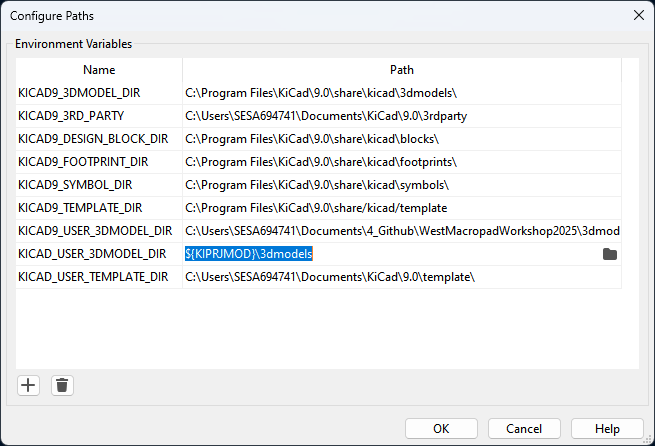

# WestMacropadWorkshop2025
This repository is intended to guide the user through the design of a small Macropad using KiCAD for schematic capture and PCB layout, fusion 360 for enclosure design, and QMK as the foundation for firmware.

> Students should be guided through the material by an instructor, there's not enough info for this repository to stand on its own (yet)

Step By Step - Creating Macropad Schematic
-
1) Copy WestMacropadWorkshop2025 Workshop#2 to your local machine
    - We'll learn more about github & version control later :)
    - Download the "source code (zip)" from here the github repo -> <a href="https://github.com/jessefarrell/WestMacropadWorkshop2025/releases/tag/Workshop%232">WestMacropadWorkshop2025</a>
    - 

2) Open **WestMacropadWorkshop2025/west_workshop_2025.kicad_pro**
    - This should automatically launch kicad 9
    - If not launch kicad 9 manually, and then go *File->Open Existing Project* and navigate to the above **kicad_pro** file
3) Double click **west_workshop_2025.kicad_sch** or launch the **Schematic Editor**
    - 

4) Your screen hopfully looks like this. You should be on Kicad v9 or higher.
    - 

5) Import WEST libaries (**Optional**)
    - I did some work to automate this :), symbols and footprints are already configured
    - Only **the 3D models will be missing** by default
    - If you skip this step now you'll have to do it in workshop 3 or 4
    - In the **PCB Editor** go **Preferences->Configure Paths...**
    - Add the following name and path
        - Name: KICAD_USER_3DMODEL_DIR
        - Path: ${KIPRJMOD}\3dmodels
    - 

6) Place your first symbol
    - Navigate to the **right toolbar** and click the ***"place symbols"*** (the sidways triangle button)
    - 
    - Your system will need to ***"load symbol libraries"*** the first time you do this... don't worry it only has to do this once
    - Find a random symbol and place it somewhere on the schematic
    - 🎉 First component placed!

7) Get familiar with the symbols we'll be using (place more symbols)
    - Key components have been organized into the **west_symbols libarary**, additional components related to the **advanced** macropad have not be pre configured
    - Raspberry pi pico **@west_symbols/RaspberryPi_Pico**
    - Key Switches **@west_symbols/Switch_Push**
    - Resistors **@west_symbols/Resistor**
    - LED **@west_symbols/LED**
    - MOSFET **@west_symbols/NMOS**

8) Create the diode key matrix discussed in the workshop
    - If you forget what that looks like, checkout the key matrix simulation using falstad ***WestMacropadWorkshop2025\design_documents\simulations***
    - Or take a look at the reference schematic ***WestMacropadWorkshop2025\design_documents\reference_schematic.pdf***
    - NOTE - If you're searching online you might see some schematics where the diodes are flipped compared to ours... this is because the **direction can be managed by QMK**, so long as **every diode is the same direction**

9) Create the backlight driver circuit
    - If you forget what that looks like, checkout the backlight driver simulation using falstad ***WestMacropadWorkshop2025\design_documents\simulations***
    - Or take a look at the reference schematic ***WestMacropadWorkshop2025\design_documents\reference_schematic.pdf***

10) Connect the backlight and matrix to the Pi Pico
    - So long as you connect them to a GPIO, it doesn't matter which specific GPIO you use
    - If you doing something more advanced such as driving a display, **BEWARE** not every GPIO is equivalent