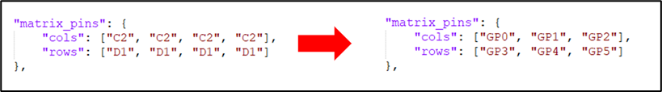
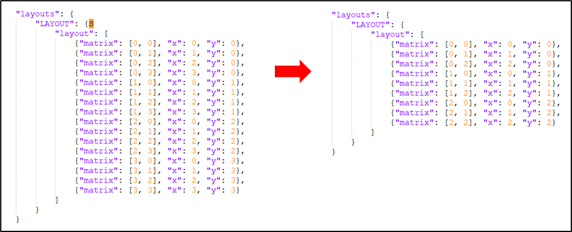
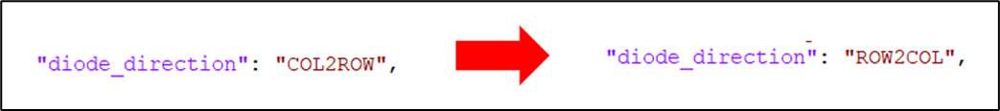
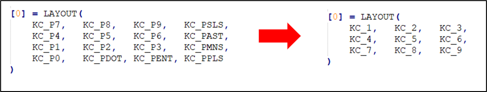
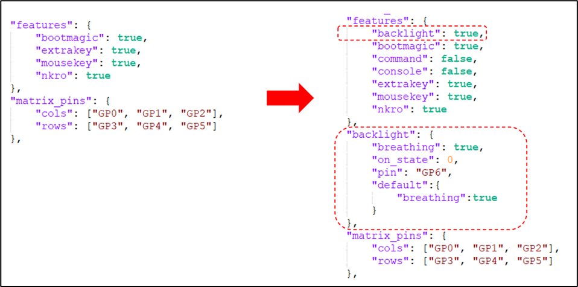

# <u>Work In Progress!</u>
# QMK Workshop Guide

This guide will walk you through the process of creating and customizing your own QMK-powered macropad. Whether you're using our basic macropad or bringing your own design, follow along to get started.

<em>NOTE - These instructions are focused on the basic macropad. All pins used in this guide will be based on its [reference schematic](https://github.com/jessefarrell/WestMacropadWorkshop2025/blob/main/design_documents/reference_schematic_A.pdf). Changes <u>will</u> be required if you are not using the basic macropad reference design.</em>

---

## Helpful Links
* **Overview and Setup**

  * [QMK Setup Tutorial](https://docs.qmk.fm/newbs) – A good starting point/alternative to this document!
  * [Setting Up Your QMK Environment](https://docs.qmk.fm/#/newbs_getting_started) – Environment installation and setup
  * [Basic Keycodes](https://docs.qmk.fm/#/keycodes_basic) – Keycode reference
  * [More Keycodes](https://docs.qmk.fm/keycodes) - Even more keycodes!
* Advanced Macropad, Useful Links
  * [QMK RP2040](https://docs.qmk.fm/platformdev_rp2040) - QMK documentation about RP2040 support
  * [QMK Rotary Encoders](https://docs.qmk.fm/features/encoders) - QMK documentation for adding rotary encoders
  * [QMK WS2812](https://docs.qmk.fm/drivers/ws2812) - QMK Documentation for WS2812 (RGB) LEDs
  * [QMK OLED Driver](https://docs.qmk.fm/features/oled_driver) - QMK Documentation for 
  
* **Common QMK Commands**
  * `qmk doctor`
  * `qmk new-keyboard` 
  * `qmk lint -kb 0_se_west/<keyboard_name> -km default`
  * `qmk compile -kb 0_se_west/<keyboard_name> -km default`

## QMK Files Overview

* `readme.md` – Required documentation file
* `keyboard.json` – Used by QMK to configure your keyboard
* `keymap.c` – Defines the keymap, ie what each button "does" on your macropad
* `others...` – QMK projects have many more files, but the above 3x are the main ones we need to interact with regularly


# Creating a Custom Keyboard (Step-by-Step)

### 1. Install QMK MSYS
> <strong>This should already be done before the workshop. Ask if you're unsure :) </strong>
* Go to [QMK MSYS](https://msys.qmk.fm/)
* Click the "Latest version" button
* Download and install the EXE

### 2. Initial Setup
> <strong>Same as above, this should be done before the workshop</strong>
* Launch QMK MSYS and run:

  ```bash
  qmk setup
  ```
* Accept any prompts

### 3. Create a New Keyboard

* Navigate to `qmk_firmware/keyboards`
* Create a new folder: `0_se_west`
* Run the follwoing command from QMK MSYS

  ```bash
  qmk new-keyboard
  ```

  Enter the following when prompted:

  * **Keyboard Name:** `0_se_west/demo3x3` (or name it something custom!)
  * **GitHub Username:** `None`            (not necassary but recommended)
  * **Your Name:** `<your name or alias>`
  * **Default Layout:** `65 (none of the above)`
  * **Development Board:** `n`
  * **Microcontroller:** `21 (rp2040)`
  * <em> Afterwards you should see a new folder at `qmk_firmware/keyboards/0_se_west/demo3x3` </em>

### 4. Compile Test

* Run:

  ```bash
  qmk compile -kb 0_se_west/demo3x3 -km default
  ```
* This will fail, but confirms the project is buidling correctly
- 

### 5. Update `readme.md`

* Open `qmk_firmware/keyboards/0_se_west/demo3x3/readme.md`
* Edit the following lines:

  ```md
  Line 3: 
  Line 5: *Demonstration MVP keyboard for WEST*
  Line 8: *Hardware Supported: Raspberry Pi Pico*
  Line 9: *Hardware Availability: RPI store*
  ```
* Re-run linting:

  ```bash
  qmk lint -kb 0_se_west/demo3x3
  ```

  You should see `Lint check passed!`

### 6. Open World!
* At this point your project is all setup and you can start adding the features you'd like on your macropad.
* If you're strictly doing the basic macropad you can continue reading this document in order (just skip the Advanced Features section)... so follow the <strong>Buttons / Keys</strong> section, <strong>Static Backlight</strong>, and <strong>Flashing the RP2040</strong>

---

# One Key Macropad
The easiest macropad we can make, not to mention one which requires very few components, is a single key macropad! This is an easy way to confrim that your development board (the Raspberry Pi Pico) is okay, and it helps us confirm that your build environment is working. 


## 1) Modify the Code
You need to modify two files to setup the single key keyboard. 
-  `keyboard.json`
-  `keymap.c`

### 1a) Modify `keyboard.json`
We only need to do 2 things in keyboard.json.
1) Define the "matrix_pins"
2) Define the "layouts"
```json
{
  "matrix_pins": {
    "cols": ["GP0"],
    "rows": ["GP1"]
  },
  "layouts": {
    "LAYOUT": {
      "layout": [
        { "matrix": [0, 0], "x": 0, "y": 0 }
      ]
    }
  }
}

```


### 1b) Modify `keymap.c`
This is where we will define what the key actually does. To do this you'll need to modify the `LAYOUT`. In the example below we're modifying the key to send (`KC_ENTER`), but you can use any key you'd like.
```c
#include QMK_KEYBOARD_H

const uint16_t PROGMEM keymaps[][MATRIX_ROWS][MATRIX_COLS] = {
    [0] = LAYOUT(
        KC_ENTER // Change to any keycode you want
    )
};

```

## 2) Compile and Test
```bash
qmk lint -kb 0_se_west/demo3x3 -km default
qmk compile -kb 0_se_west/demo3x3 -km default
```

## 3) Flash the RP2040
[See flashing instructions](#Flashing-the-RP2040)


# Basic Macropad

## 1) Buttons / Keys
There are several things that need to be changed here, and if you're not using the basic macropad design we provided some of these changes will look different based on your specific design. I’ll go over each change and why we’re making the change, hopefully this will help illustrate where you might need to make changes. If you’re feeling a bit lost have a look at the example keyboard files used on the basic macropad.

#### 1a) Modify `keyboard.json`

* List GPIOs under `matrix_pins`
    - First let’s tell QMK which GPIO are connected to which column and row. We can do this by modifying the matrix_pins “cols” and “rows” data. For the basic macropad we used GPIO0 to GPIO5. So, we made the following change. 
    - 
    ```json
    "matrix_pins": {
        "cols": ["GP0", "GP1", "GP2"],
        "rows": ["GP3", "GP4", "GP5"]
    },
    ```


* Define your physical key layout under `layouts`
    - Next modify the layouts field. This tells qmk where the keys are located on your macropad.
    - 
    ```json
    "layout": [
        {"matrix": [0, 0], "x": 0, "y": 0},
        {"matrix": [0, 1], "x": 1, "y": 0},
        {"matrix": [0, 2], "x": 2, "y": 0},
        {"matrix": [1, 0], "x": 0, "y": 1},
        {"matrix": [1, 1], "x": 1, "y": 1},
        {"matrix": [1, 2], "x": 2, "y": 1},
        {"matrix": [2, 0], "x": 0, "y": 2},
        {"matrix": [2, 1], "x": 1, "y": 2},
        {"matrix": [2, 2], "x": 2, "y": 2}
    ]
    ```

* Set `diode_direction`

    - Finally, you might need to change the “diode_direction” for your macropad. The diodes on our basic macropad “point” from row to column. So we’ll make the following change. 
    - 
    ```json
    "diode_direction": "ROW2COL",
    ```
#### 1b) Modify `keymap.c`

* Add functions to `LAYOUT()` as needed
    - We need to tell QMK what each of these 9keys should "do", by defining the LAYOUT in keymap.c. Have a look at the all the [keycodes available](https://docs.qmk.fm/keycodes).
    - 
    ```C++
    [0] = LAYOUT(
		KC_1,   KC_2,   KC_3,
        KC_4,   KC_5,   KC_6,
        KC_7,   KC_8,   KC_9
    )
    ```

#### 1c) Compile and test:
Check that everything’s "good" by running <strong>qmk lint -kb 0_se_west/demo3x3 -km default</strong> (change demo3x3 for the name of your keyboard). In my case QMK returned an error. Based on this I found I had a typo “S” in my keyboard.json file. You can actually see it in the earlier screenshots… After correcting this I get “Lint check passed!”

Run the following two commands. See "Flashing the RP2040" for the next steps.


```bash
qmk lint -kb 0_se_west/demo3x3 -km default
qmk compile -kb 0_se_west/demo3x3 -km default
```

## 2) Static Backlight (Not RGB)
There are few different types of lighting effects you might want to use on your macropad. The following process is how I setup the “breathing” affect on the basic macropad. Note that this will not work on RGB lights, its indented for a single colour LED.

#### 2a) Modify `keyboard.json`

* We need to give QMK some information about our backlight. For the basic macropad that included the following changes to keyboard.json.
- 
```json
"features": {
		"backlight": true,
        "bootmagic": true,
        "extrakey": true,
        "mousekey": true,
        "nkro": true
    },
	"backlight": {
        "breathing": true,
        "on_state": 0,
        "pin": "GP6",
        "default":{
            "breathing":true
        }
    },
```

#### 2b) Add New Supporting Files

Create these 3 files in `0_se_west/demo3x3`, paste the content into the file then save and close the file. <em>NOTE – the copyright comment is done to satisfy the linting tool.</em>

**`halconf.h`**

```c
// Copyright 2020 xxx
#pragma once
#define HAL_USE_PWM TRUE
#include_next <halconf.h>
```

**`mcuconf.h`**

```c
// Copyright 2020 xxx 
#pragma once
#include_next <mcuconf.h>
#undef RP_PWM_USE_PWM3
#define RP_PWM_USE_PWM3 TRUE
```

**`config.h`**:

```c
// Copyright 2020 xxx
#pragma once
#define BACKLIGHT_PWM_DRIVER PWMD3
#define BACKLIGHT_PWM_CHANNEL RP2040_PWM_CHANNEL_A
```

#### 2c) Compile and test:
Same as before...
Check that everything’s "good" by running <strong>qmk lint -kb 0_se_west/demo3x3 -km default</strong> (change demo3x3 for the name of your keyboard). In my case QMK returned an error. Based on this I found I had a typo “S” in my keyboard.json file. You can actually see it in the earlier screenshots… After correcting this I get “Lint check passed!”

Run the following two commands. See "Flashing the RP2040" for the next steps.

```bash
qmk lint -kb 0_se_west/demo3x3 -km default
qmk compile -kb 0_se_west/demo3x3 -km default
```

---

# Advanced Macropad ===Pending Notes===
* **Rotary Encoders**: [QMK Encoders](https://docs.qmk.fm/features/encoders)
* **WS2812 RGB**: [QMK WS2812](https://docs.qmk.fm/drivers/ws2812)
* **OLED Displays**: [QMK OLED Driver](https://docs.qmk.fm/features/oled_driver)

---

# Flashing the RP2040

1. Locate your compiled `.uf2` file in `qmk_firmware/.build`
2. Hold BOOTSEL (the button on the development board) and plug in the Raspberry Pi Pico
3. A new drive `RPI-RP2` should appear on your computer
4. Drag and drop the `.uf2` file onto this drive
5. The drive will auto-eject when flashing completes

> **Note:** To re-flash, repeat the BOOTSEL process each time.

---
