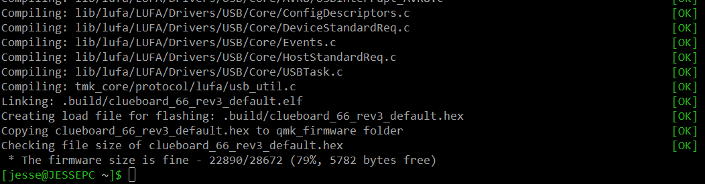
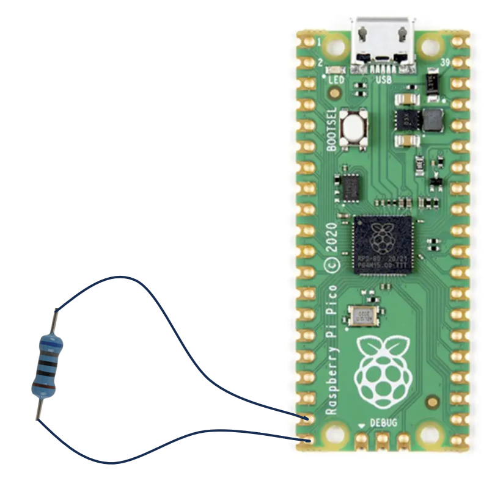
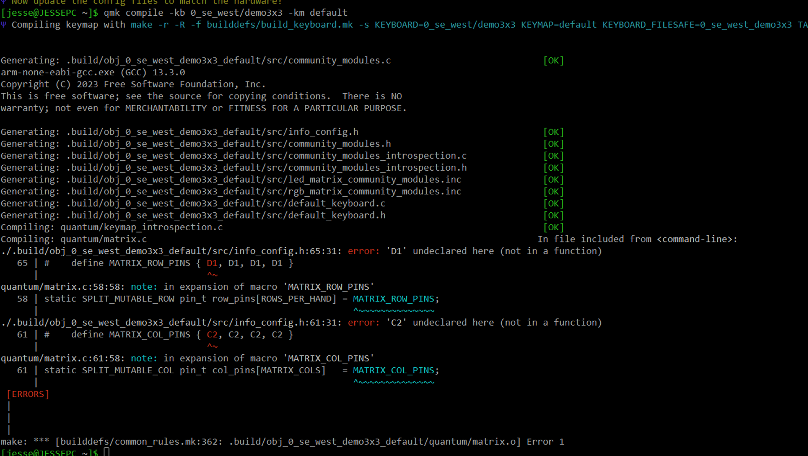


---
---
# Table of Contents
[QMK Workshop Guide](#qmk-workshop-guide)
- [Document Overview](#document-overview)
- [Helpful Links](#helpful-links)
- [QMK Files](#qmk-files)

[1. Setting Up QMK](#1-setting-up-qmk)
- [1.1 Install QMK MSYS](#11-install-qmk-msys)
- [1.2 Prepare Your Build Environment](#12-prepare-your-build-environment)
- [1.3 Confirm Result Looks Good](#13-test-your-build-environment)

[2. One Key Macropad](#2-one-key-macropad)
- [2.1 Create Your New Keyboard](#21-create-your-new-keyboard)
- [2.2 Modify the Code](#22-modify-the-code)
- [2.3 Compile](#23-compile)
- [2.4 Flash the RP2040](#24-flash-the-rp2040)
- [2.5 Test It](#25-test-it)

[3. Basic Macropad](#3-basic-macropad)
- [3.1 Create Your New Keyboard](#31-create-your-new-keyboard)
- [3.2 Add Buttons](#32-add-buttons)
- [3.3 Test the Button Feature](#33-test-the-button-feature)
- [3.4 Add Backlight](#34-add-backlight)
- [3.5 Test the Backlight Feature](#35-test-the-backlight-feature)

[4. Advanced Macropad Features](#4-advanced-macropad-features)
- [4.1 Rotary Encoders](#41-rotary-encoders)
- [4.2 RGB Lighting](#42-rgb-lighting)
- [4.3 OLED Display](#43-oled-display)

[General Steps](#general-steps)
- [Flashing the RP2040](#flashing-the-rp2040)
- [Create a New Keyboard](#creating-a-new-keyboard)

---
---
# QMK Workshop Guide

## Document Overview
This guide will walk you through the process of creating and customizing your own QMK-powered macropad. Whether you're using our basic macropad or bringing your own design, follow along to get started.

<em>NOTE - These instructions are focused on the basic macropad. All pins used in this guide will be based on its [reference schematic](https://github.com/jessefarrell/WestMacropadWorkshop2025/blob/main/design_documents/reference_schematic_A.pdf). Changes <u>will</u> be required if you are not using the basic macropad reference design.</em>

## Helpful Links
* **Overview and Setup**
  * [QMK Setup Tutorial](https://docs.qmk.fm/newbs) – A good starting point/alternative to this document!
  * [Setting Up Your QMK Environment](https://docs.qmk.fm/#/newbs_getting_started) – Environment installation and setup
  * [Basic Keycodes](https://docs.qmk.fm/#/keycodes_basic) – Keycode reference
  * [More Keycodes](https://docs.qmk.fm/keycodes) - Even more keycodes!

* **Advanced Macropad, Useful Links**
  * [QMK RP2040](https://docs.qmk.fm/platformdev_rp2040) - QMK documentation about RP2040 support
  * [QMK Rotary Encoders](https://docs.qmk.fm/features/encoders) - QMK documentation for adding rotary encoders
  * [QMK WS2812](https://docs.qmk.fm/drivers/ws2812) - QMK Documentation for WS2812 (RGB) LEDs
  * [QMK OLED Driver](https://docs.qmk.fm/features/oled_driver) - QMK Documentation for 
  
* **Common QMK Commands**
  * `qmk doctor`
  * `qmk new-keyboard` 
  * `qmk lint -kb 0_se_west/<keyboard_name> -km default`
  * `qmk compile -kb 0_se_west/<keyboard_name> -km default`

## QMK Files

* `readme.md` – Required documentation file
* `keyboard.json` – Used by QMK to configure your keyboard
* `keymap.c` – Defines the keymap, ie what each button "does" on your macropad
* `others...` – QMK projects have many more files, but the above 3x are the main ones we need to interact with regularly

---
---
# 1. Setting Up QMK
The following steps are based on QMK's [setup documentation](https://docs.qmk.fm/newbs_getting_started). For more details please see their documentation.

## 1.1 Install QMK MSYS
> <strong>This should already be done before the workshop since it's a slow process.</strong>
* Go to [QMK MSYS](https://msys.qmk.fm/)
* Click the "Latest version" button
* Download and install the EXE

## 1.2 Prepare Your Build Environment
> <strong>Same as above, this was hopefully done before the workshop</strong>
* Launch QMK MSYS and run:

  ```bash
  qmk setup
  ```
* Accept any prompts

## 1.3 Test Your Build Environment
- Run the following command in QMK MSYS
  ```bash
  qmk compile -kb clueboard/66/rev3 -km default
  ```
- If you run into a permissions issue, relaunch QMK MSYS as admin (right click Run As Administrator)
- Depnding on your computer, this step can take several minutes to complete

## 1.4 Confirm Result Looks Good
- Once done you should see something similar to this output... 
- <strong>Reach out if you don't see this response.</strong>
- <!--  -->

---
---
# 2. One Key Macropad
The easiest macropad we can make, not to mention one which requires very few components, is a single key macropad! This is an easy way to confrim that your development board (the Raspberry Pi Pico) is okay, and it helps us confirm that your build environment is working. 

## 2.1 Create Your New Keyboard
- See [How to Setup a New QMK Keyboard](#creating-a-new-keyboard) for details.

## 2.2 Modify the Code
We only need to modify <strong>two files</strong> to setup the single key keyboard. These files are `keyboard.json`, and `keymap.c`.

### 2.2.1 Modify `keyboard.json`
We need to do two things in keyboard.json.
1) Define the "matrix_pins"
2) Define the "layouts"

**BEFORE**
```json
"matrix_pins": {
    "cols": ["C2", "C2", "C2", "C2"],
    "rows": ["D1", "D1", "D1", "D1"]
},
```
```json
"layout": [
    {"matrix": [0, 0], "x": 0, "y": 0},
    {"matrix": [0, 1], "x": 1, "y": 0},
    {"matrix": [0, 2], "x": 2, "y": 0},
    {"matrix": [0, 3], "x": 3, "y": 0},
    {"matrix": [1, 0], "x": 0, "y": 1},
    {"matrix": [1, 1], "x": 1, "y": 1},
    {"matrix": [1, 2], "x": 2, "y": 1},
    {"matrix": [1, 3], "x": 3, "y": 1},
    {"matrix": [2, 0], "x": 0, "y": 2},
    {"matrix": [2, 1], "x": 1, "y": 2},
    {"matrix": [2, 2], "x": 2, "y": 2},
    {"matrix": [2, 3], "x": 3, "y": 2},
    {"matrix": [3, 0], "x": 0, "y": 3},
    {"matrix": [3, 1], "x": 1, "y": 3},
    {"matrix": [3, 2], "x": 2, "y": 3},
    {"matrix": [3, 3], "x": 3, "y": 3}
]
```

**AFTER**

```json
  "matrix_pins": {
    "cols": ["GP14"],
    "rows": ["GP15"]
  },
```
```json
"layout": [
  { "matrix": [0, 0], "x": 0, "y": 0 }
]
```


### 2.2.2 Modify `keymap.c`
This is where we will define what the key actually does. To do this you'll need to modify the `LAYOUT`. In the example below we're modifying the key to send (`KC_A`), but you can use any key you'd like.

**BEFORE**
```c++
[0] = LAYOUT(
    KC_P7,   KC_P8,   KC_P9,   KC_PSLS,
    KC_P4,   KC_P5,   KC_P6,   KC_PAST,
    KC_P1,   KC_P2,   KC_P3,   KC_PMNS,
    KC_P0,   KC_PDOT, KC_PENT, KC_PPLS
)
```

**AFTER**
```c++
[0] = LAYOUT(
    KC_A // Change to any keycode you want
)
```

### 2.2.3 Add Autoshift (*Optional*)
Auto shift is a cool feature supported by QMK. If we enable the autoshift feature for our single key macropad, when we **hold down** the key it will send a capitalized version of the key. So instead of `a` we should see `A` in our case.

- Create a file named `rules.mk` inside your `keymaps/default` folder
- Add the following line to that new `rules.mk` file
```bash
AUTO_SHIFT_ENABLE = yes
```

## 2.3 Compile
The keyboard name and path is just an example.
```bash
qmk compile -kb 0_se_west/<your_keyboard> -km default
```

## 2.4 Flash the RP2040
Flash your Raspberry Pi Pico as per the [flashing instructions](#flashing-the-rp2040).

## 2.5 Test It!!!
- Launch a text editor (notepad, ect)
- Use a resistor to temporarily connect GPIO15 and GPIO14 on the Raspbery Pi Pico. 
- You should see the character you defined in [2.2.2](#1b-modify-keymapc) appear in your text editor
- 

---
---
# 3. Basic Macropad
The basic macropad is much more complex than the [One Key Macropad](#2-one-key-macropad). It's recommended that you test your code frequently, by compiling your code and [flashing](#flashing-the-rp2040) the RP2040.

The basic macropad will be designed in two steps or iterations...
- **Iteration 1** - Adding the nine buttons, completed example -> [LINK](https://github.com/jessefarrell/WestMacropadWorkshop2025/tree/main/firmware/FW%20files%20-%20basic%20reference%20-%20iteration%201/<your_keyboard>)
- **Iteration 2** - Adding backlight support, completed example -> [LINK](https://github.com/jessefarrell/WestMacropadWorkshop2025/tree/main/firmware/FW%20files%20-%20basic%20reference%20-%20iteration%202/<your_keyboard>)

## 3.1 Create Your New Keyboard
- See [How to Setup a New QMK Keyboard](#creating-a-new-keyboard) for details.

## 3.2 Add Buttons
This step is similar to [2.2](#22-modify-the-code), we just have more keys... similar to before we'll need to modify two files `keyboard.json`, and `keymap.c`.


### 3.2.1 Modify `keyboard.json`

#### `matrix_pins`
- First let’s tell QMK which GPIO are connected to which column and row. We can do this by modifying the `matrix_pins` “cols” and “rows” data. For the basic macropad we used GPIO0 to GPIO5. So, we made the following change. 

  **BEFORE**
  ```json
  "matrix_pins": {
      "cols": ["C2", "C2", "C2", "C2"],
      "rows": ["D1", "D1", "D1", "D1"]
  },
  ```

  **AFTER**
  ```json
  "matrix_pins": {
      "cols": ["GP0", "GP1", "GP2"],
      "rows": ["GP3", "GP4", "GP5"]
  },
  ```

#### `layouts`
- Next modify the layouts field. This tells qmk where the keys are located on your macropad. Also notice the template QMK generated for us what 4x4 and not 3x3.

  **BEFORE**
  ```json
  "layout": [
      {"matrix": [0, 0], "x": 0, "y": 0},
      {"matrix": [0, 1], "x": 1, "y": 0},
      {"matrix": [0, 2], "x": 2, "y": 0},
      {"matrix": [0, 3], "x": 3, "y": 0},
      {"matrix": [1, 0], "x": 0, "y": 1},
      {"matrix": [1, 1], "x": 1, "y": 1},
      {"matrix": [1, 2], "x": 2, "y": 1},
      {"matrix": [1, 3], "x": 3, "y": 1},
      {"matrix": [2, 0], "x": 0, "y": 2},
      {"matrix": [2, 1], "x": 1, "y": 2},
      {"matrix": [2, 2], "x": 2, "y": 2},
      {"matrix": [2, 3], "x": 3, "y": 2},
      {"matrix": [3, 0], "x": 0, "y": 3},
      {"matrix": [3, 1], "x": 1, "y": 3},
      {"matrix": [3, 2], "x": 2, "y": 3},
      {"matrix": [3, 3], "x": 3, "y": 3}
  ]
  ```

  **AFTER**
  ```json
  "layout": [
      {"matrix": [0, 0], "x": 0, "y": 0},
      {"matrix": [0, 1], "x": 1, "y": 0},
      {"matrix": [0, 2], "x": 2, "y": 0},
      {"matrix": [1, 0], "x": 0, "y": 1},
      {"matrix": [1, 1], "x": 1, "y": 1},
      {"matrix": [1, 2], "x": 2, "y": 1},
      {"matrix": [2, 0], "x": 0, "y": 2},
      {"matrix": [2, 1], "x": 1, "y": 2},
      {"matrix": [2, 2], "x": 2, "y": 2}
  ]
  ```

#### `diode_direction`

  - Finally, you might need to change the “diode_direction” for your macropad. The diodes on our basic macropad “point” from row to column. So we’ll make the following change. 
    
    **BEFORE**
    ```json
    "diode_direction": "COL2ROW",
    ```
    
    **AFTER**
    ```json
    "diode_direction": "ROW2COL",
    ```
### 3.2.2 Modify `keymap.c`

#### `LAYOUT()`
- We need to tell QMK what each of these nine keys should "do" by defining the LAYOUT in keymap.c. Have a look at the all the [keycodes available](https://docs.qmk.fm/keycodes).
    ```C++
    [0] = LAYOUT(
		KC_1,   KC_2,   KC_3,
        KC_4,   KC_5,   KC_6,
        KC_7,   KC_8,   KC_9
    )
    ```

## 3.3 Test the "Button" Feature

#### 3.3.1 Compile:
- Run the following two commands.

  ```bash
  qmk compile -kb 0_se_west/<your_keyboard> -km default
  ```
### 3.3.2 Flash the RP2040
- Flash your Raspberry Pi Pico as per the [flashing instructions](#flashing-the-RP2040).

### 3.3.3 Test It!!!
- Launch a text editor (notepad, ect)
- Press some buttons, and confirm they appear on the screen

## 3.4 Add Backlight
There are a few different types of lighting effects you might want to use on your macropad. The following process is how I setup the “breathing” effect on the basic macropad. Note that this will not work on RGB lights, its intended for a single colour LED.

### 3.4.1 Modify `keyboard.json`

- We need to give QMK some information about our backlight. For the basic macropad that included the following changes to `keyboard.json`.

  ```json
  "features": {
      "backlight": true,
      "bootmagic": true,
      "extrakey": true,
      "mousekey": true,
      "nkro": true
  },
  ```
  
  ```json
  "backlight": {
      "breathing": true,
      "on_state": 1,
      "pin": "GP6",
      "default":{ "breathing":true }
  },
  ```

### 3.4.2 Modify `keymap.c`
- The following changes make it so that holding KEY1 enables the _BACKLIGHT layer
- While holding KEY1 we can use the other keys to toggle the backlight and change its brightness
- *NOTE - The below code replaces all the contents inside keymap.c*
  ```c++
  #include QMK_KEYBOARD_H

  // define layers
  #define _NUM 0
  #define _BACKLIGHT 1

  // define custom keycodes
  #define KC_WEST_1 LT(_BACKLIGHT, KC_1)

  const uint16_t PROGMEM keymaps[][MATRIX_ROWS][MATRIX_COLS] = {
      /*
      * ┌───┬───┬───┐
      * │ 1 │ 2 │ 3 │
      * ├───┼───┼───┤
      * │ 4 │ 5 │ 6 │
      * ├───┼───┼───┤
      * │ 7 │ 8 │ 9 │
      * └───┴───┴───┘
      */
      [_NUM] = LAYOUT(
          KC_WEST_1,   KC_2,   KC_3,
          KC_4,   KC_5,   KC_6,
          KC_7,   KC_8,   KC_9
      ),
      [_BACKLIGHT] = LAYOUT(
          _______,QK_BACKLIGHT_TOGGLE,   QK_BACKLIGHT_STEP,
          QK_BACKLIGHT_UP,   QK_BACKLIGHT_DOWN,   QK_BACKLIGHT_TOGGLE_BREATHING,
          KC_7,   QK_BACKLIGHT_ON,   QK_BACKLIGHT_OFF
      )
  };
  ```

### 3.4.3 Add New Supporting Files

- Create these 3 files in `0_se_west/<your_keyboard>`, paste the content into the file then save and close the file. <em>NOTE – the copyright comment is done to satisfy the linting tool.</em>
- These three files are needed to configure the RP2040's PWM peripheral... it's a little clunky


**`halconf.h`**
```c
// Copyright 2020 xxx
#pragma once
#define HAL_USE_PWM TRUE
#include_next <halconf.h>
```

**`mcuconf.h`**

```c
// Copyright 2020 xxx 
#pragma once
#include_next <mcuconf.h>
#undef RP_PWM_USE_PWM3
#define RP_PWM_USE_PWM3 TRUE
```

**`config.h`**:

```c
// Copyright 2020 xxx
#pragma once
#define BACKLIGHT_PWM_DRIVER PWMD3
#define BACKLIGHT_PWM_CHANNEL RP2040_PWM_CHANNEL_A
```

## 3.5 Test the Backlight Feature
- Repeat steps [3.3.1](#331-compile), [3.3.2](#332-flash-the-rp2040), and [3.3.3](#333-test-it)
- Note whether the backlight works as expected...

---
---
# 4. Advanced Macropad Features
- Since everyone's advanced macropad looks different, this section will be left more generic. For details on each of the features on my advanced design see sections [4.1](#41-rotary-enocders), [4.2](#42-rgb-lighting), and [4.3](#43-oled-display).
- If you just want to see what **WE DID** for the advanced macropad, have a look at the [advanced macropad code](https://github.com/jessefarrell/WestMacropadWorkshop2025/tree/main/firmware/0_se_west/advanced).
- As a reminder our advanced macropad included a 3x3 key matrix, a rotary encoder with an integrated button, and an OLED display which displayed the Schneider Electric logo.
- **It is strongly recommended that you test each feature as you add them.** For example you could first check the rotary encoder works as expected, then attempt to add the RGB, and then the display (testing as you go).
- *NOTE - If one of the files does not exist, you might need to create it first... please reference the [advanced macropad code](https://github.com/jessefarrell/WestMacropadWorkshop2025/tree/main/firmware/0_se_west/advanced) for where to create this new file*

## 4.1 Rotary Encoders
- Review [QMK's encoder documentation](https://docs.qmk.fm/features/encoders)
- For the advanced design we enabled the feature by changing `config.h`, `keyboard.json`, `keymap.c`, and `rules.mk`.

### 4.1.1 Update `config.h`
- Add the following lines to your config.h file
- For details about each line of code please refer to [QMK's documentation](https://docs.qmk.fm/features/encoders)
  ```c++
  // Rotary Encoder Support
  #define ENCODER_RESOLUTION 5
  #define ENCODER_MAP_KEY_DELAY 10
  #define ENCODER_DIRECTION_FLIP
  ```

### 4.1.2 Update `keyboard.json`
- Add the following lines to your keyboard.json file
- This also could have been done in `config.h` (I believe)
  ```c++
  "encoder": {
      "rotary": [
          {"pin_a": "GP27", "pin_b": "GP28"}
      ]
  },
  ```

### 4.1.3 Update `keymap.c`
- Add the following lines to your keymap.c file
- This is where you can define what the rotary encoder does
- I used `KC_VOLD` and `KC_VOLU` (volume up and down), see full list of [keycodes here](https://docs.qmk.fm/keycodes)
  ```c++
  #ifdef ENCODER_MAP_ENABLE
  const uint16_t PROGMEM encoder_map[][NUM_ENCODERS][NUM_DIRECTIONS] = {
    [0] = { ENCODER_CCW_CW(KC_VOLD, KC_VOLU) },
  };
  #endif
  ```

### 4.1.4 Update `rules.mk`
- Add the following lines to your rules.mk file
  ```bash
  # Rotary encoder setup
  ENCODER_MAP_ENABLE = yes
  ENCODER_ENABLE = yes
  ```

### 4.1.5 Adding the push button
- The rotary encoder used on the advanced design included a push button
- To add the push button on the advanced design I had to update `keyboard.json` and `keymap.c`
- Note the advanced design **did not use a diode matrix** (instead it used direct connections to each switch) so it **will look different on your design**
- In `keyboard.json` the matrix had to be symmetric so I added `null` switches... `GP25` was the rotary encoder button in my case
  ```c++
  "matrix_pins": {
      "direct":[  ["GP25", null, null],
                  ["GP0", "GP3", "GP9"],
                  ["GP1", "GP4", "GP8"],
                  ["GP2", "GP5", "GP6"]]
  },
  ```
- Next I added the key in my `keymap.c`, `KC_1`
  ```c++
  [0] = LAYOUT(
      KC_1,
      UG_NEXT,   KC_2,   KC_3,
      KC_4,   KC_5,   KC_6,
      KC_7,   KC_8,   KC_9
  )
  ```

### 4.1.6 Test the Feature
- Compile your code (see previous steps)
- Check that the rotary encoder 

## 4.2 RGB Lighting
- Review [QMK's WS2812 documentation](https://docs.qmk.fm/drivers/ws2812), this is the LED everyone should have used (though QMK supports more)
- There's two ways we used to control the RGB lighting... ["rgb_matrix"](https://docs.qmk.fm/features/rgb_matrix) and ["rgblight"](https://docs.qmk.fm/features/rgblight)
- Either method will work, though I ended up using the `rgblight` feature for my design
- I'll document what **WE** did shortly... for now though I recommend doing some reading and referring to the [advanced macropad code](https://github.com/jessefarrell/WestMacropadWorkshop2025/tree/main/firmware/0_se_west/advanced)

*PENDING UPDATE*

## 4.3 OLED Display
- Review [QMK's OLED documentation](https://docs.qmk.fm/features/oled_driver), the type of display everyone should be using is an SSD1306 based 128x32 OLED
- For the advanced design we enabled the feature by changing `config.h`, `mcuconf.h`, `keyboard.json`, `keymap.c`, and `rules.mk`.
- I'll document what **WE** did shortly... for now though I recommend doing some reading and referring to the [advanced macropad code](https://github.com/jessefarrell/WestMacropadWorkshop2025/tree/main/firmware/0_se_west/advanced)

*PENDING UPDATE*

---
---
# General Steps

## Flashing the RP2040

1. Locate your compiled `.uf2` file in `qmk_firmware/.build` 
    - Note, the default path is `c:/Users/<name>/qmk_firmware/.build`)
2. Hold `BOOTSEL` (the ONLY button on the development board) and plug a USB into the Raspberry Pi Pico
3. A new drive `RPI-RP2` should appear on your computer
4. Drag and drop the `.uf2` file into this drive
5. The drive will auto-eject when flashing completes

> **Note:** To re-flash, repeat the BOOTSEL process each time.

**Other Option**
- If your're using the `flash` command below, you don't need to manually drag the `.uf2` file into `RPI-RP2`
  ```bash
  qmk flash -kb 0_se_west/<keyboard_name> -km default
  ```
- Instead just follow `step 2` above, and the Raspberry Pi Pico will be flashed


## Creating a New Keyboard
### 1. Create a New Keyboard

* Navigate to `qmk_firmware/keyboards`
* Create a new folder: `0_se_west`
* Run the following command from QMK MSYS
  ```bash
  qmk new-keyboard
  ```

Enter the following when prompted:

  * **Keyboard Name:** `0_se_west/<your_keyboard>` (choose a keyboard name!)
  * **GitHub Username:** `None`            (not necassary but recommended)
  * **Your Name:** `<your name or alias>`
  * **Default Layout:** `65 (none of the above)`
  * **Development Board:** `n`
  * **Microcontroller:** `21 (rp2040)`
  * <em> Afterwards you should see a new folder at `qmk_firmware/keyboards/0_se_west/<your_keyboard>` </em>

### 2. Compile Test

* Run:
  ```bash
  qmk compile -kb 0_se_west/<your_keyboard> -km default
  ```
* This will fail, but confirms the project is buidling correctly
- 

---
